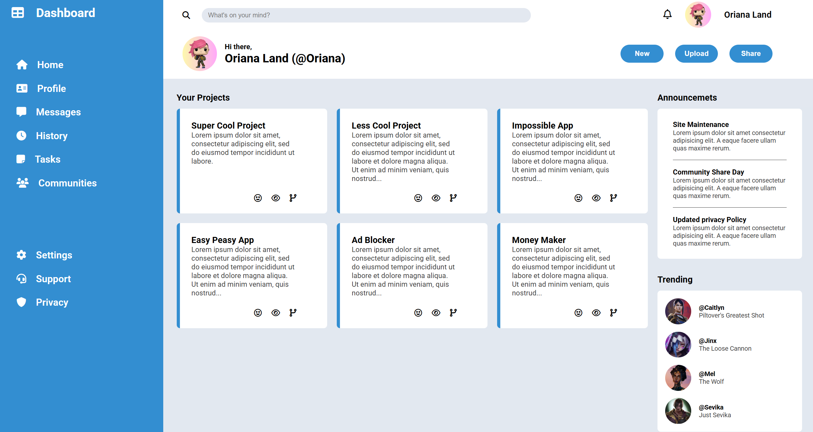
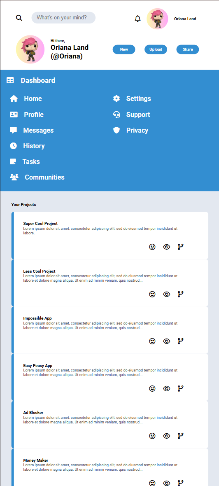
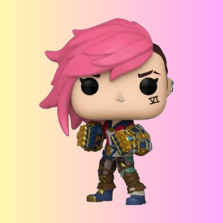

# Admin Dashboard

## 🔗 [Live Demo](https://orianaland.github.io/Admin-Dashboard/)

This project is an **Admin Dashboard UI** built as part of [The Odin Project](https://www.theodinproject.com/) curriculum. It demonstrates modern CSS Grid layout, responsive design, and integration with Font Awesome icons to create a clean and functional dashboard interface.

---

## Description

A responsive admin dashboard interface built as part of [The Odin Project](https://www.theodinproject.com/) curriculum. This project demonstrates modern UI/UX principles with a clean, functional design that adapts to different screen sizes.

---

## Features

- **Fully Responsive Layout**: Adapts seamlessly from mobile to desktop views
- **Interactive Components**:
  - Animated notification bell
  - Hover effects on buttons and navigation items
  - Focus states for form inputs
- **Modern UI Elements**:
  - Card-based project display
  - Clean sidebar navigation
  - Announcements and trending sections
- **Accessibility Focused**:
  - Semantic HTML structure
  - Proper contrast ratios
  - Keyboard-navigable interface

---

## Technologies Used

- **HTML5**: Semantic structure and accessibility
- **CSS3**:
  - CSS Grid for main layout
  - Flexbox for component layout
  - Custom properties (CSS variables)
  - Media queries for responsiveness
  - Animations and transitions
- **Font Awesome**: For icon system
- **Google Fonts**: Roboto font family

---

## How to View

1. Clone this repository or download the source code.
2. Open `index.html` in your browser.
3. Explore the dashboard, resize the browser to see the responsive design.

---

## Screenshots

### Desktop View



### Mobile View



---

## Example HTML Snippet

Here’s a snippet from the header section illustrating the search bar and notification icons:

```html
<div class="header">
  <div class="header-search">
    <i class="fa-solid fa-magnifying-glass"></i>
    <input type="text" placeholder="What's on your mind?" />
  </div>

  <div class="header-notifications">
    <a href="#notifications"><i class="fa-regular fa-bell"></i></a>
    
    <a href="#profile">Oriana Land</a>
  </div>

  <div class="header-greetings">
    
    <div class="greetings-text">
      <p id="hi">Hi there,</p>
      <a href="#profile">Oriana Land (@Oriana)</a>
    </div>
  </div>

  <div class="header-buttons">
    <button type="button" class="header-button">New</button>
    <button type="button" class="header-button">Upload</button>
    <button type="button" class="header-button">Share</button>
  </div>
</div>
```
